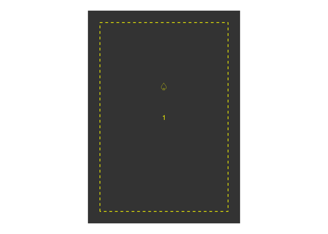
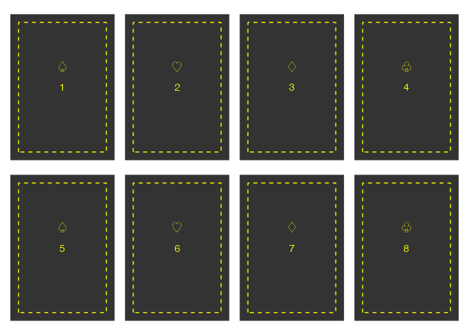

<!-- README.md is generated from README.Rmd. Please edit that file -->

# papersize

<!-- badges: start -->

[](https://lifecycle.r-lib.org/articles/stages.html#experimental)
[](https://opensource.org/licenses/MIT)
[](https://www.repostatus.org/#wip)
[](https://app.codecov.io/gh/elipousson/papersize?branch=main)
<!-- badges: end -->

The goal of papersize is to provide you with convenience functions
extending grid, ggplot2, and patchwork to help in sizing plots and files
for printing to paper, postcards, playing cards, and other physical
media.

## Installation

You can install the development version of papersize like so:

``` r
# pak::pkg_install("elipousson/papersize")
```

## Example

``` r
library(papersize)
```

papersize includes data on standard paper sizes including sizes for
papers (ANSI, ISO, and other standards), photo prints, postcards, and
playing cards.

``` r
get_paper("Letter")
#>      name series size standard units width height orientation  type       asp
#> 19 Letter   <NA> <NA>     ANSI    in   8.5     11    portrait paper 0.7727273

get_paper("Letter", orientation = "landscape")
#> # A data frame: 1 × 10
#>   name   series size  standard units width height orientation type    asp
#> * <chr>  <chr>  <chr> <chr>    <chr> <dbl>  <dbl> <chr>       <chr> <dbl>
#> 1 Letter <NA>   <NA>  ANSI     in       11    8.5 landscape   paper  1.29

get_card("Poker")
#> # A data frame: 1 × 10
#>   name       series size  standard units width height orientation type    asp
#> * <chr>      <chr>  <chr> <chr>    <chr> <dbl>  <dbl> <chr>       <chr> <dbl>
#> 1 Poker card <NA>   <NA>  <NA>     in      2.5    3.5 portrait    card  0.714
```

papersize includes plotting functions that create lists of ggplot2 plots
with repeated elements that can be assembled with patchwork into page
layouts for print.

For example, `plot_cards()` creates a list of Poker-card sized plots
that can be tiled onto a letter-size patchwork to save and print.

``` r
papersize <-
  plot_cards(
    "Poker",
    n = 8,
    number = TRUE,
    border = TRUE,
    size = 4,
    linewidth = 0.5,
    text = rep(c("\U2664", "\U2661", "\U2662", "\U2667"), 2),
    color = "yellow"
  )

papersize[[1]]
```



``` r
page_layout(
  plots = papersize,
  page = "Letter",
  orientation = "landscape"
)
#> ℹ Using `dims` from first plot in `plots`.
#> $`1`
```



This more involved example uses the internal `add_card_border()`
function to apply rectangular elements to the card plot:

``` r
card <- get_card("Poker card")

card_center <- card
card_center[["x"]] <- 0
card_center[["y"]] <- 0
card_offset <- card_center
card_offset[["y"]] <- 0.75

card_plots <- plot_cards(
  "Poker card",
  fill = "white",
  linetype = "solid",
  color = "black",
  linewidth = 0.45,
  n = 8,
  border = TRUE,
  inset = 0
)

card_plots[[1]]
```


``` r
# Add outline of image
bordered_cards <- add_card_border(
  card_plots,
  card = card_offset,
  color = "black",
  linewidth = 0.25,
  linetype = "solid",
  inset = c(0.2, 1)
)

bordered_cards[[1]]
```


``` r
bordered_cards <- bordered_cards |>
  add_card_border(
    card = card_center,
    color = "gray50",
    linewidth = 0.25,
    linetype = "solid",
    inset = c(0.1, 0.1)
  )

bordered_cards[[1]]
```


Card plots are then assembled in a page ready for export, printing, and
cutting:

``` r
card_page <- page_layout(
  plots = bordered_cards,
  page = "Letter",
  orientation = "landscape"
)
#> ℹ Using `dims` from first plot in `plots`.

card_page[[1]]
```


papersize currently has limited features but additional features are
expected to include better support for multi-page layouts, control over
the position of card elements, preset card formats/designs, and
appropriate handling of cut-lines for DIY card printing.
